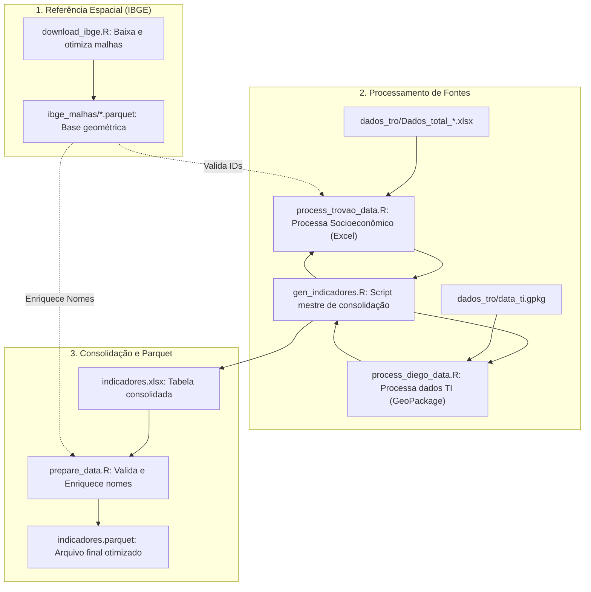
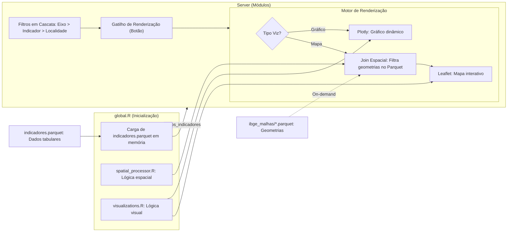

# shiny-it
Prova de conceito de um aplicativo Shiny para servir de ferramenta de visualização para o INCT.

## Estrutura do Projeto

O projeto está organizado da seguinte forma:

- **Root**: Contém os arquivos principais do aplicativo Shiny (`app.R`, `ui.R`, `server.R`, `global.R`) e scripts de processamento compartilhado.
- **`components/`**: Módulos UI e Server que compõem a interface do aplicativo.
- **`generate_indicadores/`**: Scripts responsáveis pelo processamento e consolidação dos dados de indicadores.
  - `gen_indicadores.R`: Script mestre que consolida dados de múltiplas fontes.
  - `prepare_data.R`: Valida e converte os dados consolidados para o formato Parquet.
  - `data_processor.R`, `process_diego_data.R`, `process_trovao_data.R`: Scripts de processamento específico por fonte.
- **`ibge_malhas/`**: Contém as malhas espaciais do IBGE em formato Parquet para carregamento otimizado.
  - `download_ibge.R`: Script para baixar e processar malhas do IBGE.
  - `genparquet.sh`: Script auxiliar para conversão de formatos.
- **`dados_tro/`**: Diretório para armazenamento dos dados brutos (GPKG, XLSX) utilizados no processamento.
- **`tests/`**: Testes automatizados utilizando o framework `testthat`.
- **`www/`**: Ativos estáticos (CSS, imagens).

## Fluxo de Dados e Dependências

## Fluxo de Dados e Dependências

### 1. Geração e Padronização de Dados (Pipeline)

Este fluxo descreve a preparação das malhas espaciais e a consolidação dos dados de indicadores.



**Descrição do Pipeline:**
1.  **IBGE:** O script `download_ibge.R` prepara malhas leves (simplificadas) em formato Parquet.
2.  **Processamento:** `gen_indicadores.R` coordena a leitura de dados brutos de TI e Socioeconômicos, utilizando as malhas para validar códigos territoriais.
3.  **Finalização:** `prepare_data.R` converte os resultados para Parquet, enriquecendo a tabela com nomes amigáveis (ex: transformando IDs em nomes de cidades).

---

### 2. Lógica do Aplicativo (Runtime)

O app carrega geometrias pesadas apenas sob demanda para manter a performance.



**Descrição da Lógica:**
1.  **Carga Leve:** O app inicia apenas com os dados tabulares (`indicadores.parquet`).
2.  **Filtros:** A UI utiliza filtros em cascata para navegar pelos eixos e indicadores.
3.  **Renderização sob demanda:** Gráficos são gerados instantaneamente. Para mapas, o `spatial_processor.R` lê apenas as geometrias necessárias dos arquivos Parquet (otimização de I/O), unindo-as aos dados filtrados.

## Como Executar

### 1. Preparação dos Dados

Para baixar as malhas espaciais necessárias:
```bash
cd ibge_malhas
Rscript download_ibge.R
```

Para gerar os indicadores consolidados a partir dos dados brutos:
```bash
cd generate_indicadores
Rscript gen_indicadores.R
```
Isso gerará os arquivos `indicadores.xlsx` e `indicadores.parquet` na raiz do projeto.

### 2. Execução do Aplicativo

Para rodar o aplicativo Shiny, execute na raiz do projeto:
```bash
Rscript -e "shiny::runApp()"
```

## Testes

Os testes podem ser executados com o comando:
```bash
Rscript -e "testthat::test_dir('tests/testthat')"
```
