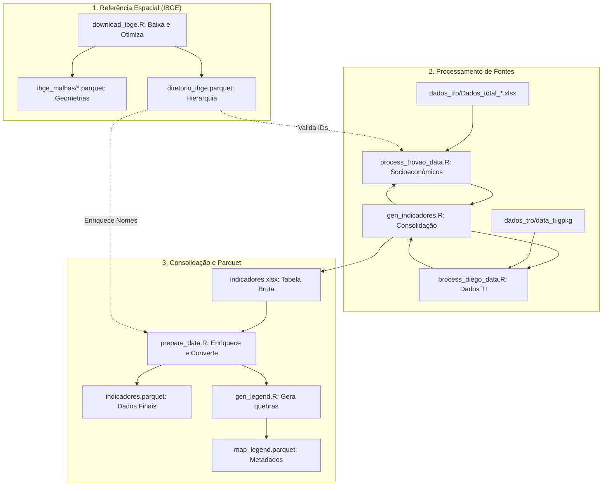
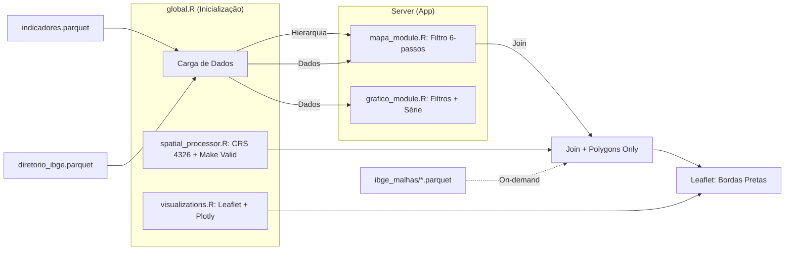

# shiny-it
Prova de conceito de um aplicativo Shiny para servir de ferramenta de visualização para o INCT.

## Estrutura do Projeto

O projeto está organizado da seguinte forma:

- **Root**: Contém os arquivos principais do aplicativo Shiny (`app.R`, `ui.R`, `server.R`, `global.R`) e scripts de processamento compartilhado.
  - `indicadores.parquet`: Base de dados consolidada.
  - `diretorio_ibge.parquet`: Dicionário de hierarquias territoriais (Brasil > Estado > RM > Município).
  - `map_legend.parquet`: Metadados de classes e cores para as legendas dos mapas.
- **`components/`**: Módulos UI e Server que compõem a interface do aplicativo.
  - `mapa_module.R`: Módulo com filtragem hierárquica dinâmica.
  - `grafico_module.R`: Módulo para visualizações temporais.
  - `sidebar.R`, `header.R`, `body.R`, `footer.R`: Componentes estruturais do layout.
- **`generate_indicadores/`**: Scripts responsáveis pelo processamento e consolidação dos dados de indicadores.
  - `gen_indicadores.R`: Script mestre de consolidação.
  - `prepare_data.R`: Enriquece indicadores com nomes do diretório IBGE.
  - `gen_legend.R`: Calcula quebras de classes.
- **`ibge_malhas/`**: Contém as malhas espaciais do IBGE em formato Parquet.
- **`dados_tro/`**: Diretório para armazenamento dos dados brutos (GPKG, XLSX).
- **`tests/`**: Testes automatizados (`testthat`).
- **`www/`**: Ativos estáticos (CSS, imagens).

## Fluxo de Dados e Dependências

### 1. Geração e Padronização de Dados (Pipeline)



---

### 2. Lógica do Aplicativo (Runtime)



**Descrição da Lógica:**
1.  **Filtragem Hierárquica:** O `mapa_module.R` utiliza um fluxo de 6 passos (Eixo > Indicador > Granularidade > Recorte > Unidade > Ano), onde o `diretorio_ibge.parquet` garante que apenas recortes válidos para a granularidade selecionada sejam exibidos.
2.  **Robustez Espacial:** O `spatial_processor.R` realiza o tratamento de geometrias usando `st_make_valid`, filtra apenas polígonos (`st_collection_extract`) e projeta para WGS84 (EPSG:4326), garantindo compatibilidade total com o Leaflet.
3.  **Clareza Visual:** Os mapas utilizam bordas pretas mais espessas nos municípios para facilitar a distinção entre unidades territoriais, eliminando a necessidade de camadas de silhueta redundantes.

## Como Executar

### 1. Preparação dos Dados

Para baixar malhas e gerar o diretório IBGE:
```bash
Rscript download_ibge.R
```

Para gerar os indicadores:
```bash
cd generate_indicadores
Rscript gen_indicadores.R
```

### 2. Execução do Aplicativo

Execute na raiz do projeto:
```bash
Rscript -e "shiny::runApp()"
```
