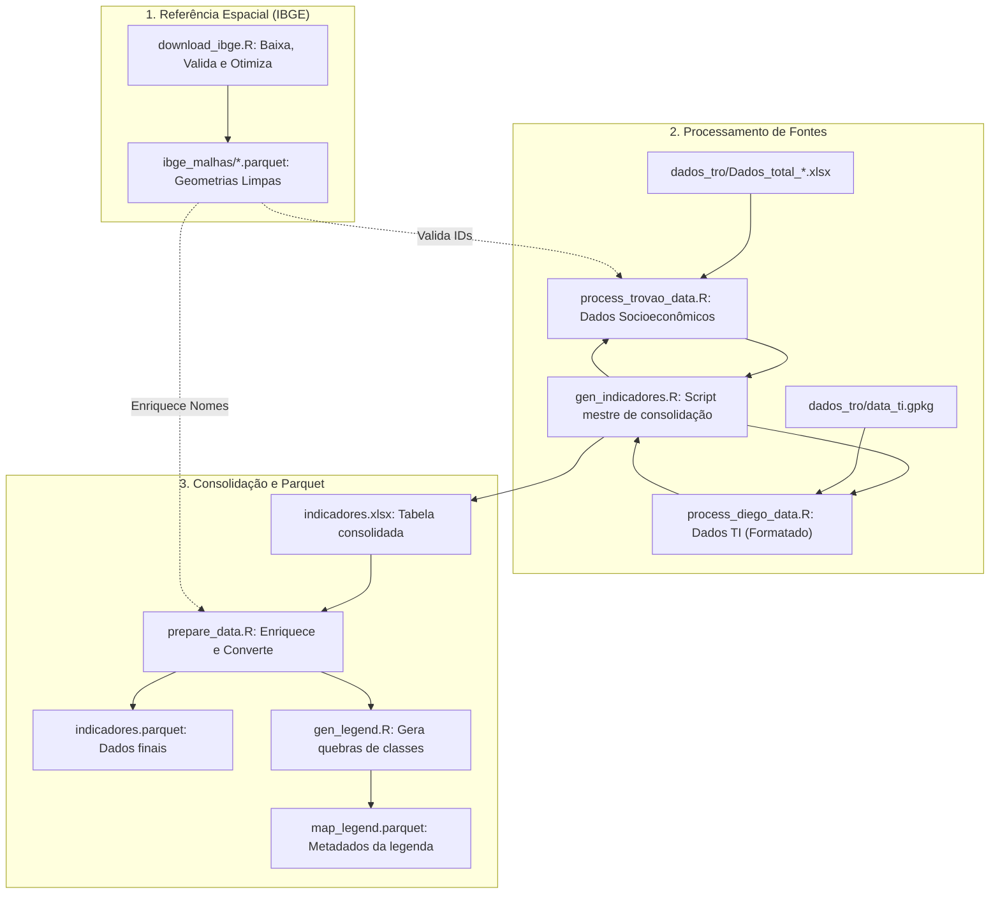
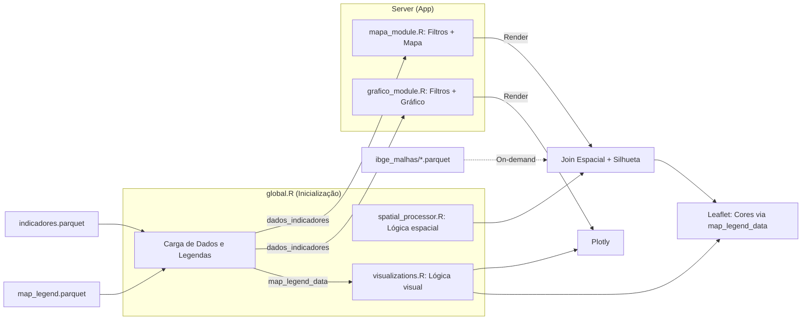

# shiny-it
Prova de conceito de um aplicativo Shiny para servir de ferramenta de visualização para o INCT.

## Estrutura do Projeto

O projeto está organizado da seguinte forma:

- **Root**: Contém os arquivos principais do aplicativo Shiny (`app.R`, `ui.R`, `server.R`, `global.R`) e scripts de processamento compartilhado.
  - `indicadores.parquet`: Base de dados consolidada.
  - `map_legend.parquet`: Metadados de classes e cores para as legendas dos mapas.
- **`components/`**: Módulos UI e Server que compõem a interface do aplicativo.
  - `mapa_module.R`: Módulo específico para visualizações geográficas.
  - `grafico_module.R`: Módulo específico para visualizações temporais/gráficas.
  - `sidebar.R`, `header.R`, `body.R`, `footer.R`: Componentes estruturais do layout.
- **`generate_indicadores/`**: Scripts responsáveis pelo processamento e consolidação dos dados de indicadores.
  - `gen_indicadores.R`: Script mestre que consolida dados de múltiplas fontes.
  - `prepare_data.R`: Valida e converte os dados consolidados para o formato Parquet.
  - `gen_legend.R`: Calcula quebras de classes e metadados de legenda para consistência visual.
- **`ibge_malhas/`**: Contém as malhas espaciais do IBGE em formato Parquet para carregamento otimizado.
- **`dados_tro/`**: Diretório para armazenamento dos dados brutos (GPKG, XLSX).
- **`tests/`**: Testes automatizados utilizando o framework `testthat`.
- **`www/`**: Ativos estáticos (CSS, imagens).

## Fluxo de Dados e Dependências

### 1. Geração e Padronização de Dados (Pipeline)

Este fluxo descreve a preparação das malhas espaciais e a consolidação dos dados de indicadores com metadados de legenda.



---

### 2. Lógica do Aplicativo (Runtime)

O app utiliza os metadados pré-calculados para uma renderização rápida e modularizada.



**Descrição da Lógica:**
1.  **Arquitetura Modular:** O aplicativo foi refatorado em módulos (`mapa_module.R` e `grafico_module.R`). Cada módulo gerencia seus próprios filtros internamente, localizados em um painel lateral (`bs4Card`) dentro da página, restaurando o layout de duas colunas (filtros à esquerda, visualização à direita).
2.  **Legendas Consistentes:** O `global.R` carrega as definições de classes de `map_legend.parquet`. Isso permite que o `visualizations.R` use rótulos amigáveis em vez de valores brutos.
3.  **Visualização Avançada:** O mapa inclui agora uma silhueta preta em negrito (`st_union`) para destacar o território selecionado e controle de camadas base.

## Como Executar

### 1. Preparação dos Dados

Para baixar e validar as malhas espaciais:
```bash
cd ibge_malhas
Rscript download_ibge.R
```

Para gerar os indicadores e metadados de legenda:
```bash
cd generate_indicadores
Rscript gen_indicadores.R
```

### 2. Execução do Aplicativo

Execute na raiz do projeto:
```bash
Rscript -e "shiny::runApp()"
```
