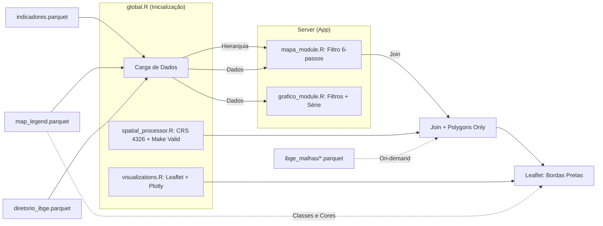

# shiny-it
Prova de conceito de um aplicativo Shiny para servir de ferramenta de visualização para o INCT.

## Contrato de Dados (`indicadores.parquet`)

O aplicativo consome uma **tabela pronta**: `indicadores.parquet`. Essa tabela é o **contrato de dados (DTO)** entre a fonte de dados e o aplicativo — é a única entrada de indicadores que o app conhece e lê em tempo de execução (`global.R:45`).

> ⚠️ **O `indicadores.parquet` versionado neste repositório é apenas um dado de DEMONSTRAÇÃO.** Ele existe para que o app rode imediatamente, sem nenhum passo de geração.

**Papel da tabela e regra de atualização:**

- O app **não gera** indicadores: ele apenas lê a tabela pronta. Em produção, o `indicadores.parquet` é fornecido pela fonte de dados, respeitando o schema abaixo.
- **Para atualizar os dados, basta substituir/atualizar o `indicadores.parquet`** (e o `map_legend.parquet`, caso existam indicadores de mapa). **Nenhum script de `generate_indicadores/` precisa ser executado** — esses scripts são apenas demonstração (veja o [Apêndice](#apêndice-opcional-como-o-indicadoresparquet-de-demonstração-foi-gerado)).
- Os scripts de processamento só seriam revisitados em caso de **mudança estrutural no app** (novas colunas no contrato, novo tipo de visualização, etc.).

**Schema esperado pelo app** (colunas lidas pelos módulos):

| Coluna | Descrição |
| --- | --- |
| `eixo` | Eixo temático do indicador |
| `projeto` | Projeto ao qual o indicador pertence |
| `ano` | Ano de referência (inteiro) |
| `unidade_territorial` | Nível territorial: `"Brasil"`, `"Estado"`, `"Região Metropolitana"`, `"Município"` |
| `identificador_unidade_territorial` | ID usado para join com as malhas espaciais |
| `tipo_visualizacao` | `"Mapa"` ou `"Gráfico"` |
| `nome_indicador` | Nome do indicador (rótulo de exibição) |
| `descricao_indicador` | Descrição do indicador |
| `valor_indicador` | Valor numérico do indicador |
| `unidade_medida` | Unidade de medida |
| `classe_indicador` | Classe/quebra usada na legenda (relevante para mapas) |
| `titulo_visualizacao` | Título exibido na visualização |
| `fonte_dados` | Atribuição da fonte de dados |
| `link_ckan_dados` | URL do conjunto de dados no CKAN |
| `nome_unidade_territorial` | Nome legível da unidade territorial (enriquecido a partir do diretório IBGE) |

## Estrutura do Projeto

O projeto está organizado da seguinte forma:

- **Root**: Contém os arquivos principais do aplicativo Shiny (`app.R`, `ui.R`, `server.R`, `global.R`) e scripts de processamento compartilhado.
  - `indicadores.parquet`: Base de dados consolidada.
  - `diretorio_ibge.parquet`: Dicionário de hierarquias territoriais (Brasil > Estado > RM > Município).
  - `map_legend.parquet`: Metadados de classes e cores para as legendas dos mapas.
- **`components/`**: Módulos UI e Server que compõem a interface do aplicativo.
  - `mapa_module.R`: Módulo com filtragem hierárquica dinâmica.
  - `grafico_module.R`: Módulo para visualizações temporais.
  - `sidebar.R`, `header.R`, `body.R`, `footer.R`: Componentes estruturais do layout.
- **`generate_indicadores/`**: Scripts de **demonstração** que mostram uma forma de produzir o `indicadores.parquet` a partir de fontes brutas. **Não são executados pelo app** (veja o [Apêndice](#apêndice-opcional-como-o-indicadoresparquet-de-demonstração-foi-gerado)).
  - `gen_indicadores.R`: Script mestre de consolidação.
  - `prepare_data.R`: Enriquece indicadores com nomes do diretório IBGE.
  - `gen_legend.R`: Calcula quebras de classes.
- **`ibge_malhas/`**: Contém as malhas espaciais do IBGE em formato Parquet.
- **`dados_tro/`**: Diretório para armazenamento dos dados brutos (GPKG, XLSX).
- **`tests/`**: Testes automatizados (`testthat`).
- **`www/`**: Ativos estáticos (CSS, imagens).

## Fluxo de Dados em Tempo de Execução (Runtime)

O app carrega, na inicialização (`global.R`), três tabelas Parquet já prontas — `indicadores.parquet`, `map_legend.parquet` e `diretorio_ibge.parquet` — e lê as malhas espaciais (`ibge_malhas/*.parquet`) sob demanda apenas quando um mapa é renderizado. **Nenhum script de geração é executado em tempo de execução.**



**Descrição da Lógica:**
1.  **Filtragem Hierárquica:** O `mapa_module.R` utiliza um fluxo de 6 passos (Eixo > Indicador > Granularidade > Recorte > Unidade > Ano), onde o `diretorio_ibge.parquet` garante que apenas recortes válidos para a granularidade selecionada sejam exibidos.
2.  **Robustez Espacial:** O `spatial_processor.R` realiza o tratamento de geometrias usando `st_make_valid`, filtra apenas polígonos (`st_collection_extract`) e projeta para WGS84 (EPSG:4326), garantindo compatibilidade total com o Leaflet.
3.  **Clareza Visual:** Os mapas utilizam bordas pretas mais espessas nos municípios para facilitar a distinção entre unidades territoriais, eliminando a necessidade de camadas de silhueta redundantes.

## Como Executar

### Início Rápido (recomendado)

O repositório **já inclui todos os dados de demonstração** necessários — `indicadores.parquet`, `map_legend.parquet`, `diretorio_ibge.parquet` e as malhas em `ibge_malhas/*.parquet`. Não é preciso gerar nada: basta executar o app na raiz do projeto:

```bash
Rscript -e "shiny::runApp()"
```

### Atualização dos Dados

Para atualizar os dados exibidos, **substitua o `indicadores.parquet`** por uma versão que respeite o [contrato de dados](#contrato-de-dados-indicadoresparquet). Se houver indicadores de mapa, atualize também o `map_legend.parquet`. Não é necessário rodar os scripts de `generate_indicadores/`.

---

## Apêndice (Opcional): Como o `indicadores.parquet` de demonstração foi gerado

> ℹ️ **Esta seção é apenas demonstrativa.** Os scripts de `generate_indicadores/` (incluindo `process_diego_data.R` e `process_trovao_data.R`) foram criados como **prova de conceito** de uma forma de montar a tabela `indicadores.parquet` a partir de fontes brutas.
>
> - **A versão atual do app roda sem depender desses scripts** — eles não fazem parte do tempo de execução.
> - Em produção, o `indicadores.parquet` é fornecido pela fonte de dados conforme o [contrato](#contrato-de-dados-indicadoresparquet); **para novas atualizações, atualize apenas o `indicadores.parquet`** (salvo mudança estrutural no app).
> - O diagrama e os comandos abaixo servem apenas como referência histórica de como o dado de demonstração foi produzido.

### Pipeline de geração (referência histórica)


### Comandos (referência histórica)

Baixar malhas e gerar o diretório IBGE:
```bash
Rscript download_ibge.R
```

Reconstruir o `indicadores.parquet` (e o `map_legend.parquet`) de demonstração a partir das fontes brutas:
```bash
cd generate_indicadores
Rscript gen_indicadores.R
```
